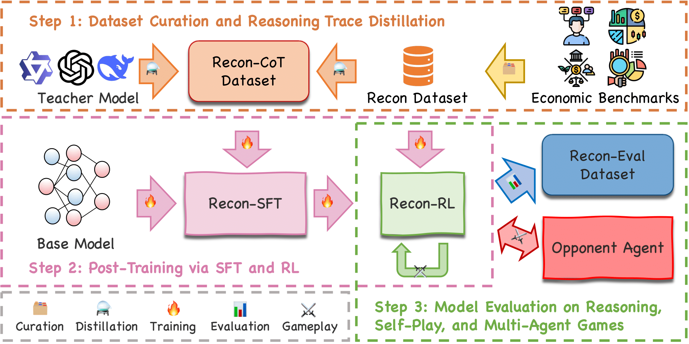

#  (Recon) Reasoning Like an Economist: Post-Training on Economic Problems Induces Strategic Generalization in LLMs
   
[Yufa Zhou*†<sup>1</sup>](https://masterzhou1.github.io/), [Shaobo Wang*<sup>2,3</sup>](https://gszfwsb.github.io/), Xingyu Dong*<sup>4</sup>, Xiangqi Jin<sup>2</sup>, Yifang Chen<sup>5</sup>, Yue Min<sup>2</sup>,   
Xingzhang Ren<sup>3</sup>, Kexin Yang<sup>3</sup>, [Dayiheng Liu<sup>3</sup>](https://dayihengliu.github.io/), [Linfeng Zhang†<sup>2</sup>](http://www.zhanglinfeng.tech/)

*Equal contribution, †Corresponding authors   
<sup>1</sup>Duke University, <sup>2</sup>EPIC Lab, Shanghai Jiao Tong University, <sup>3</sup>Qwen Team, Alibaba Group,   
<sup>4</sup>University of Pennsylvania, <sup>5</sup>The University of Chicago

[[📄 Paper]](https://arxiv.org/abs/2506.00577)  


---

## 📖 Introduction

Training large language models (LLMs) directly for multi-agent scenarios poses significant challenges, such as complex reward modeling, coordination difficulties, and competing objectives. In contrast, post-training techniques like Supervised Fine-Tuning (SFT) and Reinforcement Learning with Verifiable Rewards (RLVR) have shown promise in enhancing reasoning abilities. This leads to a central question:

*Can post-training techniques generalize effectively to multi-agent scenarios?*

**Recon** addresses this by adopting *economic* reasoning as a structured testbed. We curate 2,100 high-quality economic reasoning problems across 15 categories and employ a two-stage post-training pipeline (Base→SFT→GRPO).

Our results demonstrate that domain-aligned post-training enables LLMs to generalize from textbook economic problems to emergent, rational behavior in multi-agent games—bridging the gap between single-agent and strategic multi-agent reasoning.

---

## 🔄 Pipeline

Recon follows a three-step pipeline:

1. **Dataset Curation & Reasoning Trace Distillation:**
   - Curate high-quality economic problems and reasoning traces from benchmarks and teacher models to form the Recon dataset.
2. **Post-Training via SFT & RL:**
   - Post-train a base model using Supervised Fine-Tuning (Recon-SFT) and Group Relative Policy Optimization (Recon-RL) on the curated dataset.
3. **Evaluation:**
   - Evaluate models on economic reasoning benchmarks, self-play, and multi-agent games against opponent agents.

<p align="center">
  
</p>

---

## 🏗️ Repo Structure

- `data/` — Datasets and benchmarks for economic reasoning and multi-agent games
- `images/` — Figures and diagrams for documentation and papers
- `SFT_Training.ipynb` — Supervised fine-tuning pipeline
- `GRPO_Training.ipynb` — GRPO training pipeline
- `data_curation.ipynb` — Dataset curation and reasoning trace distillation
- `vllm_evaluate.ipynb` — Model evaluation scripts

---

## 🔍 Insights & Takeaways

- **Domain-aligned post-training works:** Structured economic reasoning tasks lead to strong generalization, enabling models to excel in both single-agent and multi-agent settings.
- **Strategic behavior emerges:** Recon models not only solve textbook problems but also display rational, game-theoretic behavior in unseen interactive games.
- **SFT + GRPO is effective:** The two-stage pipeline yields clear gains in both accuracy and strategic alignment, validating this approach for aligning LLMs with economic and multi-agent objectives.
- **Scalable and interpretable alignment:** Recon's approach provides a scalable route to agent alignment, with richer, self-correcting reasoning chains that enhance interpretability and facilitate auditing.

---

## 📚 Citation

If you find Recon helpful for your research, please cite our work:

```
@article{zhou2025recon,
  title={Reasoning Like an Economist: Post-Training on Economic Problems Induces Strategic Generalization in LLMs},
  author={Zhou, Yufa and Wang, Shaobo and Dong, Xingyu and Jin, Xiangqi and Chen, Yifang and Min, Yue and Yang, Kexin and Ren, Xingzhang and Liu, Dayiheng and Zhang, Linfeng},
  journal={arXiv preprint arXiv:2506.00577},
  year={2025},
  url={https://arxiv.org/abs/2506.00577}
}
```

---

## 📬 Contact

For questions or collaborations, feel free to reach out:

📧 yufa.zhou[at]duke.edu


